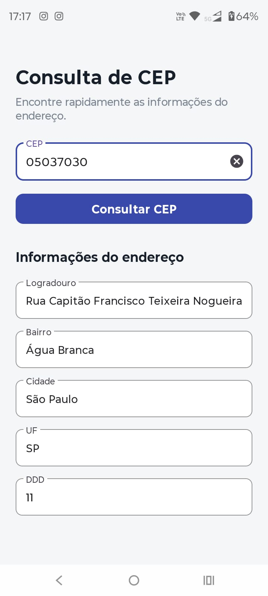
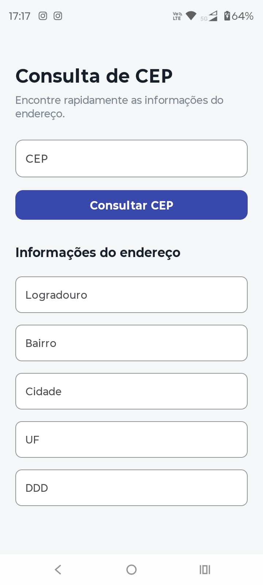

# Consulta de CEP

Aplicativo Android desenvolvido em Kotlin (Android Studio) para consultar informações de endereços a partir de um CEP, consumindo a API ViaCEP.

## Sobre o projeto

O aplicativo permite que o usuário insira um CEP e, ao tocar em "Consultar CEP", realiza uma chamada à API ViaCEP e apresenta na tela os dados retornados (logradouro, bairro, cidade, UF, DDD etc.). O projeto foi desenvolvido como exercício para praticar Kotlin, consumo de APIs, tratamento de respostas JSON e coroutines.

## Funcionalidades

- Consulta de endereço através do CEP
- Consumo de API externa (ViaCEP)
- Exibição de logradouro, bairro, cidade, UF e DDD
- Tratamento de CEPs inválidos ou sem resultado
- Interface para dispositivos Android

## Tecnologias

- Kotlin
- Android Studio
- Android SDK
- Coroutines
- AndroidX
- HTTP/REST (ViaCEP)

## API utilizada

- ViaCEP — https://viacep.com.br/

Exemplo de consulta (retorna JSON):

https://viacep.com.br/ws/01001000/json/

## Interface (capturas de tela)

Abaixo estão as capturas presentes na pasta `screenshots` do repositório.



*Tela inicial: insira o CEP e toque em "Consultar CEP".*



*Tela com os campos preenchidos com os dados retornados pela API.*

> Observação: se a segunda imagem também estiver vazia ou for igual à primeira, substitua `screenshots/tela-dados.jpeg` pela captura correta com os campos preenchidos.

## Estrutura do projeto

Uma visão simplificada da estrutura:

```
ConsultaCEP/
│
├── app/
│   └── src/
│       └── main/
│           ├── java/
│           │   └── .../
│           │       ├── MainActivity.kt
│           │       └── api/
│           │           └── ViaCepClient.kt
│           └── res/
│               ├── drawable/
│               ├── layout/
│               ├── mipmap/
│               └── values/
│
├── screenshots/
│   ├── tela-vazia.jpeg
│   └── tela-dados.jpeg
│
├── build.gradle.kts
├── settings.gradle.kts
└── README.md
```

## Como executar

1. Clone o repositório:

```
git clone https://github.com/Karina-Amorim-Dev/AppConsultaCep.git
```

2. Abra o projeto no Android Studio.
3. Aguarde a sincronização do Gradle e instalação das dependências.
4. Execute o app em um emulador ou dispositivo Android.
5. Insira um CEP válido (ex.: `01001-000`) e toque em "Consultar CEP".

## Conceitos praticados

- Criação de interfaces Android
- Programação em Kotlin
- Validação de entrada
- Consumo de APIs REST
- Tratamento de JSON
- Coroutines

## Desenvolvedora

Karina Amorim

## Licença

Projeto para fins educacionais.
